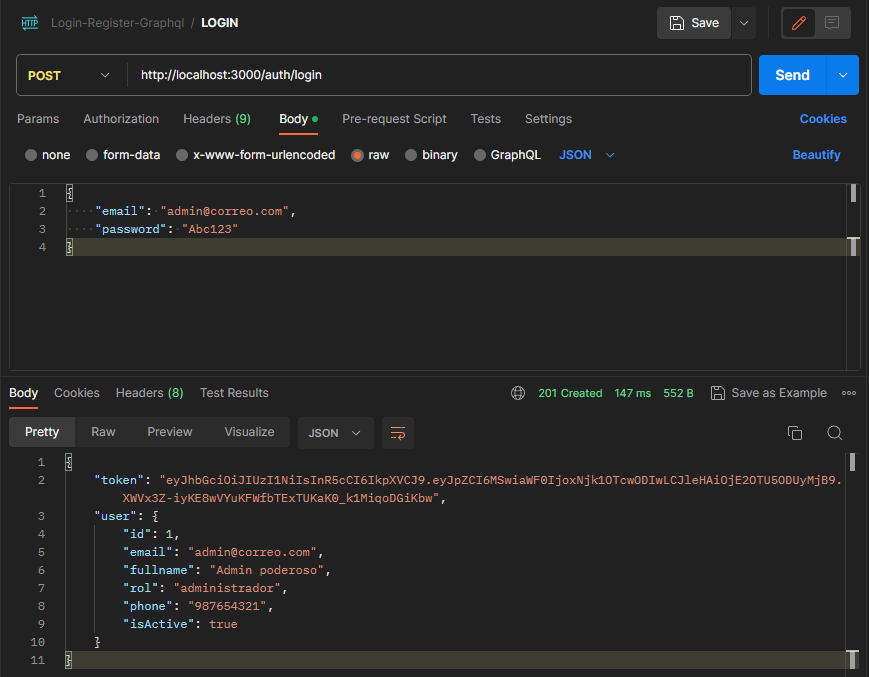
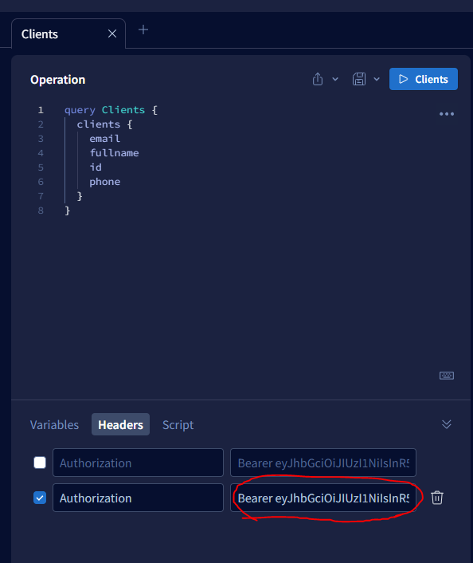

## Description

[Nest](https://github.com/nestjs/nest) framework TypeScript starter repository.

## Instalar

```bash
$ npm install
```
## Correr la base de datos(solo la primera vez, recuerda abrir el docker)

```bash
$ docker-compose up -d

## Correr la app

```bash
$ npm run start:dev
```

## NOTA IMPORTANTE: EL ADMINISTADOR ES EL ÚNICO QUE PUEDE CREAR CUENTAS DE USUARIOS.
## Para usar la cuenta como administrador debes utilizar postman y hacer lo de la imagen, pero usando la url de la página, no del localhost.

## Luego extrae el token y en Apollo colocar así:

## De esta manera, podrás hacer las consultas u operaciones. El JWT solo dura 4 horas.

## Test

```bash
# unit tests
$ npm run test

# e2e tests
$ npm run test:e2e

# test coverage
$ npm run test:cov
```

## Support

Nest is an MIT-licensed open source project. It can grow thanks to the sponsors and support by the amazing backers. If you'd like to join them, please [read more here](https://docs.nestjs.com/support).

## Stay in touch

- Author - [Kamil Myśliwiec](https://kamilmysliwiec.com)
- Website - [https://nestjs.com](https://nestjs.com/)
- Twitter - [@nestframework](https://twitter.com/nestframework)

## License

Nest is [MIT licensed](LICENSE).
